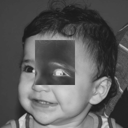
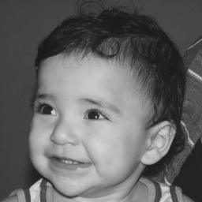

# DCA0445 Digital Image Processing
Repository destined to contain the solutions to some problems involving Digital Image Processing.

## Considerations
All code examples are compiled with the command

    $ make /path/to/executable

NOTE: the ```path/to/executable``` is the same path of its ```.cpp``` file.

# First unit exercises

## Exercise 1
This exercise is about the most use case of the ```OpenCV``` library: read an image and display it. For this, the following code was used:

```cpp
    #include <iostream>
    #include <opencv2/opencv.hpp>

    int main(int argc, char** argv){
      cv::Mat image;
      image = cv::imread(argv[1],cv::IMREAD_GRAYSCALE);

      cv::imshow("image", image);
      cv::waitKey();

      return 0;
    }
```

Where the image was read from ```argv[1]```, saved ind a ```cv::Mat``` object and then displayed as a grayscale image. The result was:

<p align="center">
  
</p>

## Exercise 2.1
*"Utilizando o programa [```exemplos/pixels.cpp```](https://agostinhobritojr.github.io/tutorial/pdi/exemplos/pixels.cpp) como referência, implemente um programa regions.cpp. Esse programa deverá solicitar ao usuário as coordenadas de dois pontos $P_1$ e $P_2$ localizados dentro dos limites do tamanho da imagem e exibir que lhe for fornecida. Entretanto, a região definida pelo retângulo de vértices opostos definidos pelos pontos $P_1$ e $P_2$ será exibida com o negativo da imagem na região correspondente. O efeito é ilustrado na Figura 4"*.

The solution of this problem was relatively easy, since it was only a matter of two aditional steps:

1) Read the coordinates of the area that will be  modified to negative:
```cpp
	void read_coordinates(int& x, int& y, int& width, int& height) {
		cout << "Write the rectangle area to invert: " << endl;
		cout << "x: "; cin >> x;
		cout << "y: "; cin >> y;
		cout << "width: "; cin >> width;
		cout << "height: "; cin >> height;
		}
```

2) And then modify the image at the area by taking the complement of the pixels' values in the area specified before

```cpp
	void invert_image_region(Mat& image, int x, int y, int width, int height) {
		for (int i = x; i < (x + height); i++) {
			for (int j = y; j < (y + width); j++) {
				// realizing the inversion as a complement operation
				image.at<uchar>(i, j) = 255 - image.at<uchar>(i, j);
			}
		}
	}
```

Resulting on the following result for the coordinates $(80, 70)$ and $(170, 160)$, *i.e.*, 

* $x = 80$; 
* $y = 70$;
* $with = 80$;
* $height = 90$;
  
<p align="center">
  
</p>

## Exercise 2.2
*"Utilizando o programa [```exemplos/pixels.cpp```](https://agostinhobritojr.github.io/tutorial/pdi/exemplos/pixels.cpp) como referência, implemente um programa ```trocaregioes.cpp```. Seu programa deverá trocar os quadrantes em diagonal na imagem. Explore o uso da classe ```Mat``` e seus construtores para criar as regiões que serão trocadas. O efeito é ilustrado na Figura 5."*

To start developing on this problem, it is necessary to first read the image (passed as an argument to the script's executions ```argv[1]```)

```cpp
	cv::Mat image;

	image = cv::imread(argv[1], cv::IMREAD_GRAYSCALE);
	if (!image.data) {
		std::cout << "The image could not be opened." << std::endl;
		exit(-1);
	}
```

Then, we can do the proper sorting of the image. For this, it will be necessary to create four rectangles whose dimensions are of $1/4$ of the original image, *i.e.*,

```cpp
	int rect_height = image.cols/2;
	int rect_width = image.rows/2;
```

which will lead to the instantiation of the rectangles

```cpp
	cv::Rect rect_left_up(0, 0, rect_width, rect_height);
	cv::Rect rect_right_up(rect_width, 0, rect_width, rect_height);
	cv::Rect rect_left_down(0, rect_height, rect_width, rect_height);
	cv::Rect rect_right_down(rect_width, rect_height, rect_width, rect_height);
```

But this alone does not make each of the ```Rect()``` objects as a data fragment of the original image. This is done as it follows

```cpp
	cv::Mat image_left_up = image(rect_left_up);
	cv::Mat image_right_up = image(rect_right_up);
	cv::Mat image_left_down = image(rect_left_down);
	cv::Mat image_right_down = image(rect_right_down);
```

Finally, a mapping where the first element is the area (```Rect()```) to be selected and the second is the proper part of the original image. The pairs (```Rect()```, ```image```) represents which areas of the image will swapped.

```cpp
	vector<pair<cv::Rect, cv::Mat>> mapping; 
	mapping.push_back({rect_left_up, image_right_down});
	mapping.push_back({rect_right_up, image_left_down});
	mapping.push_back({rect_left_down, image_right_up}); 
	mapping.push_back({rect_right_down, image_left_up});
```

At the end, making the changes on a copy of the original images, we iterate over the mappings and make the swaps by recreating the image.

```cpp
	cv::Mat sorted_image = image.clone();

	for(pair<cv::Rect, cv::Mat>& sort_map : mapping) {
		(sort_map.second).copyTo(sorted_image(sort_map.first));
	}
```

The results are the following

<div>
	<p align="center">
		
		
	</p>
</div>